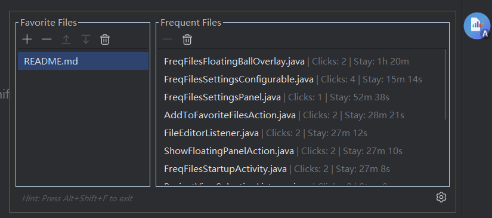
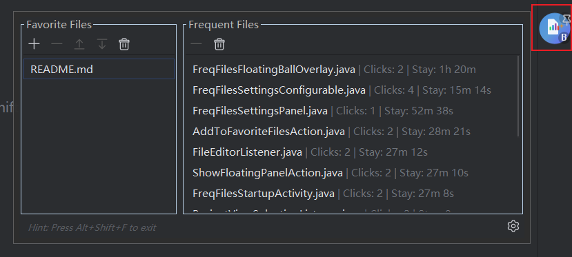
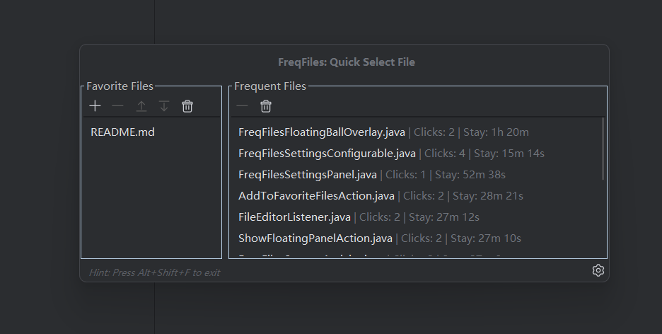
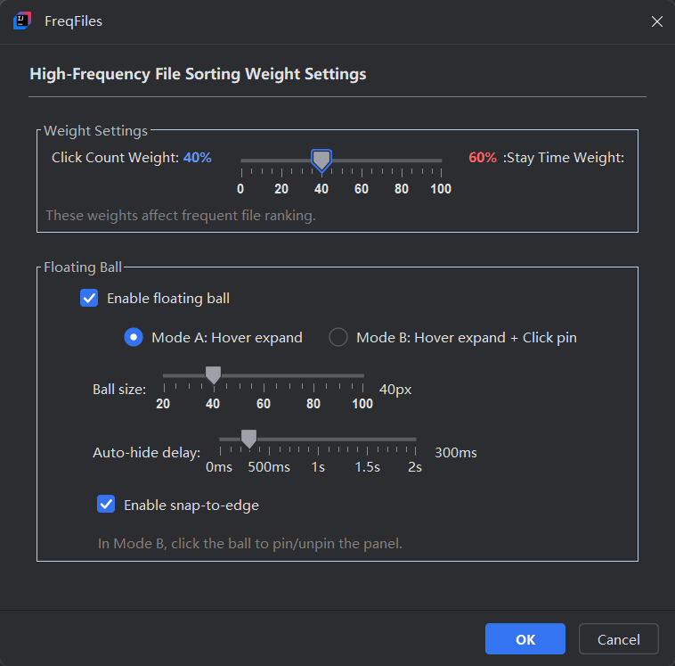
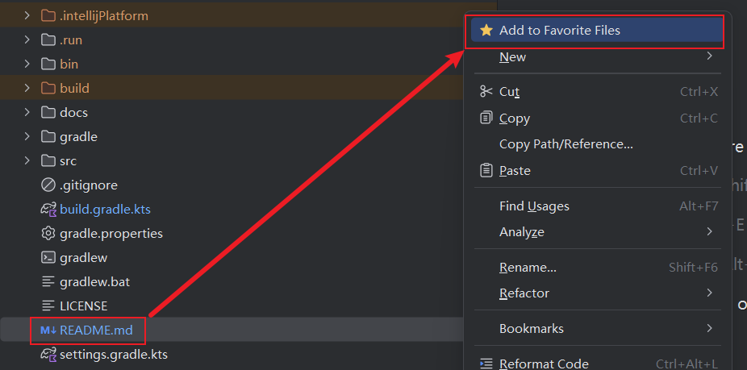
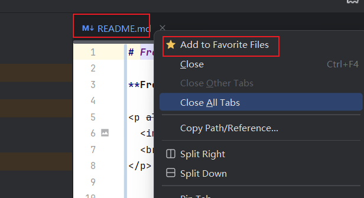

<a href="#english">English</a> | <a href="#chinese">中文版</a>

# FreqFiles - Your Smart File Access Assistant for IntelliJ IDEA

**FreqFiles** is a powerful file management plugin for IntelliJ IDEA that helps you quickly access your favorite and frequently used files. Boost your productivity by organizing and accessing your most important files with ease, either through a classic floating panel or an elegant floating ball.

  

---

## ✨ Highlights

### Floating Ball

  

  

  

### Panels

  

### Settings

  

### Context Menu

  
   
  

---

## ✨ Features

### 🔮 Floating Ball
- **Always-on-top** floating ball for instant access.
- **Hover to Expand** to reveal the full panel.
- **Two Modes**:
  - **Mode A (Hover)**: hover-to-expand, mouse-leave-to-collapse.
  - **Mode B (Click to Pin)**: hover-to-expand, click to pin/unpin.
- **Drag & Snap**: draggable, snap-to-edge, position persists.
- **Customizable**: size, auto-hide delay, snap-to-edge.
- **Auto-Startup**: appears automatically on project open.

### 🎯 Favorite Files
- Manually save frequently used files.
- Supports files inside/outside your project.
- Reorder with up/down.
- Double-click to open.

### 📊 Frequent Files
- Tracks click count + stay time.
- Shows Top 50 by smart ranking.
- Ranking weights are configurable.

### 🎨 Classic Floating Panel
- Resizable & movable popup panel.
- Toggle with `Shift+Alt+F` (when floating ball is disabled).

### ⚙️ Customizable Settings
- Floating ball settings + ranking weights.
- Entry: **File → Settings → Tools → FreqFiles**.

### 🔗 Context Menu Integration
- Add to favorites from Project view / editor tabs / editor content.

### 💾 Persistent Storage
- Favorites, stats, and ball position persist across IDE restarts.

---

## 🚀 Usage

### Floating Ball (Default)
1. Floating ball appears on project startup.
2. Hover to expand.
3. Mode B: click to pin/unpin.
4. Drag to move, release to snap.
5. `Shift+Alt+F` toggles visibility.

### Classic Floating Panel
1. Disable "Enable floating ball" in settings.
2. Press `Shift+Alt+F` to toggle the popup panel.

### Managing Files
- Add to favorites: `+` button or right-click menu.
- Remove/reorder: `-`, `↑`, `↓`, `🗑️`.
- Open: double-click.

---

## 🔧 Installation
1. **File → Settings → Plugins**
2. Marketplace → search "FreqFiles" → Install
3. Restart IDE

---

# FreqFiles - 智能文件助手

**FreqFiles** 是一款 IntelliJ IDEA 插件，用来帮助你更快访问**常用文件**与**高频文件**。你既可以使用传统的悬浮面板，也可以使用更轻量的**悬浮球**来随时展开面板，提高日常开发效率。

  

---

## ✨ 主要截图

### 悬浮球

  

  

  

### 面板

  

### 设置

  

### 右键菜单

  
   
  

---

## ✨ 功能特性

### 🔮 悬浮球（推荐）
- **常驻入口**：悬浮球随时展开面板，不遮挡。
- **Hover 展开**：鼠标移入展开，移出收起。
- **两种模式**：
  - **模式 A**：纯 Hover。
  - **模式 B**：Hover + 点击固定/取消固定。
- **拖拽吸边 + 位置记忆**：拖动后吸边，重启后保持位置。
- **可配置**：大小、收起延时、吸边开关、模式 A/B。
- **启动自动显示**：打开项目自动出现。

### 🎯 常用文件
- 手动维护常用文件列表。
- 支持项目内外文件。
- 支持上移/下移。
- 双击打开。

### 📊 高频文件
- 自动统计点击次数与停留时长。
- 展示 Top 50。
- 权重可配置。

### 🎨 传统悬浮面板
- 可移动/可缩放的 popup 面板。
- 在禁用悬浮球时，`Shift+Alt+F` 切换显示。

### ⚙️ 设置
- 悬浮球 + 权重设置。
- 入口：**File → Settings → Tools → FreqFiles**。

### 🔗 右键菜单
- Project / 编辑器标签 / 编辑器区域右键快速添加。

### 💾 持久化
- 常用文件、高频统计、悬浮球位置都会保存并随 IDE 重启恢复。

---

## 🚀 使用说明

### 悬浮球（默认）
1. 打开项目后自动出现。
2. Hover 展开。
3. 模式 B：点击固定/取消固定。
4. 拖拽移动，松手吸边。
5. `Shift+Alt+F` 切换显示/隐藏。

### 传统悬浮面板
1. 在设置中关闭 "Enable floating ball"。
2. `Shift+Alt+F` 切换 popup 面板。

### 常用操作
- 添加：`+` 或右键菜单。
- 删除/排序：`-`、`↑`、`↓`、`🗑️`。
- 打开：双击。

---

## 🔧 安装
1. **File → Settings → Plugins**
2. Marketplace 搜索 **FreqFiles** 安装
3. 重启 IDE

---
